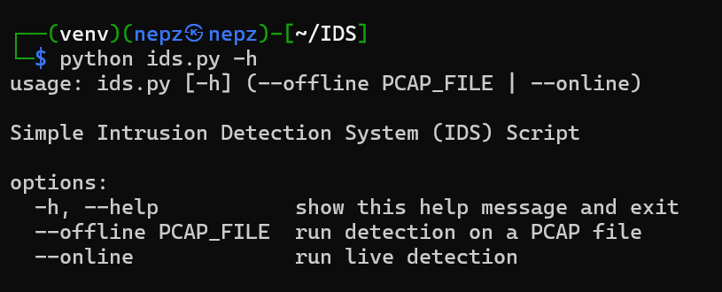
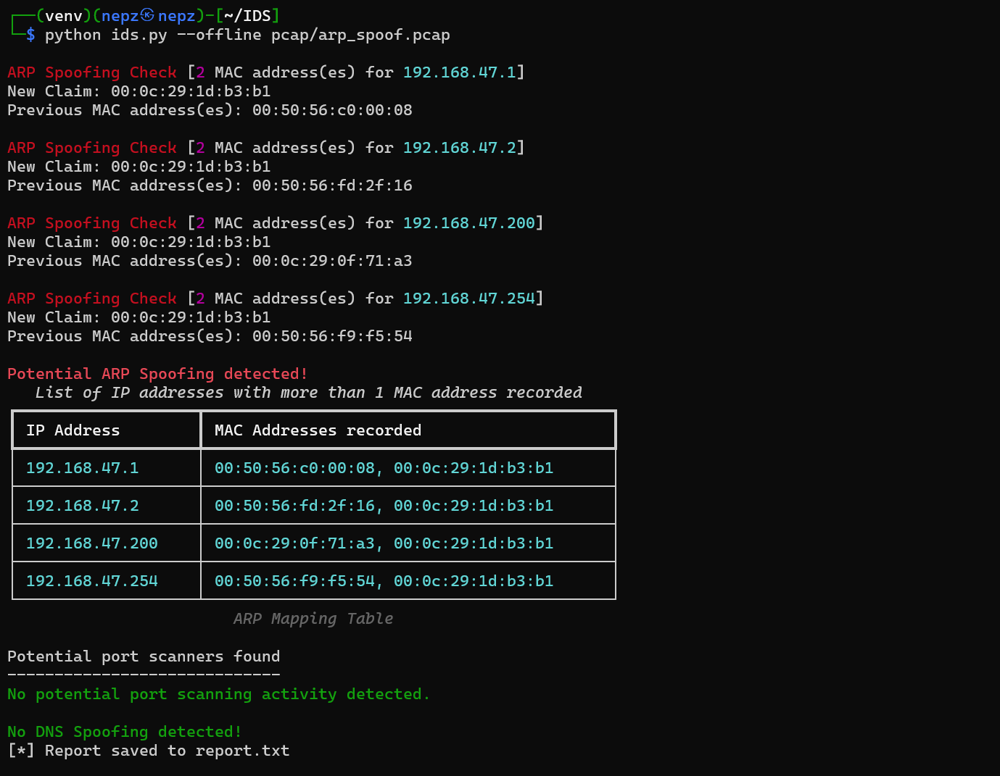
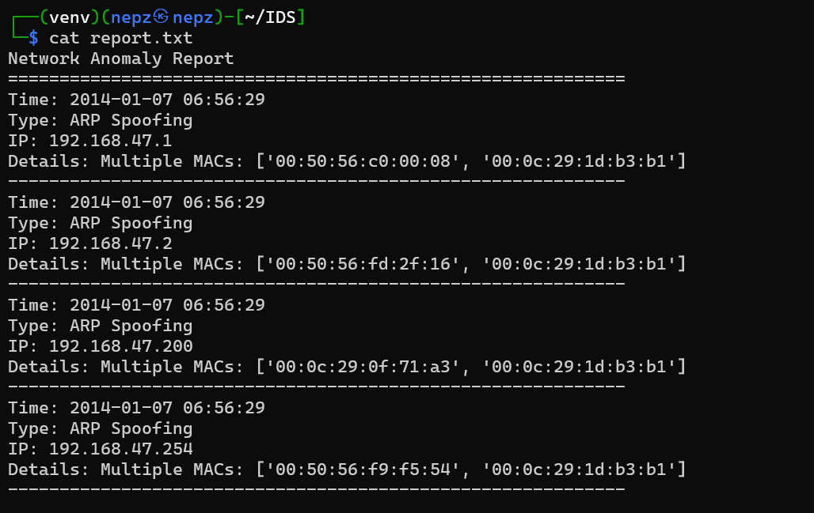
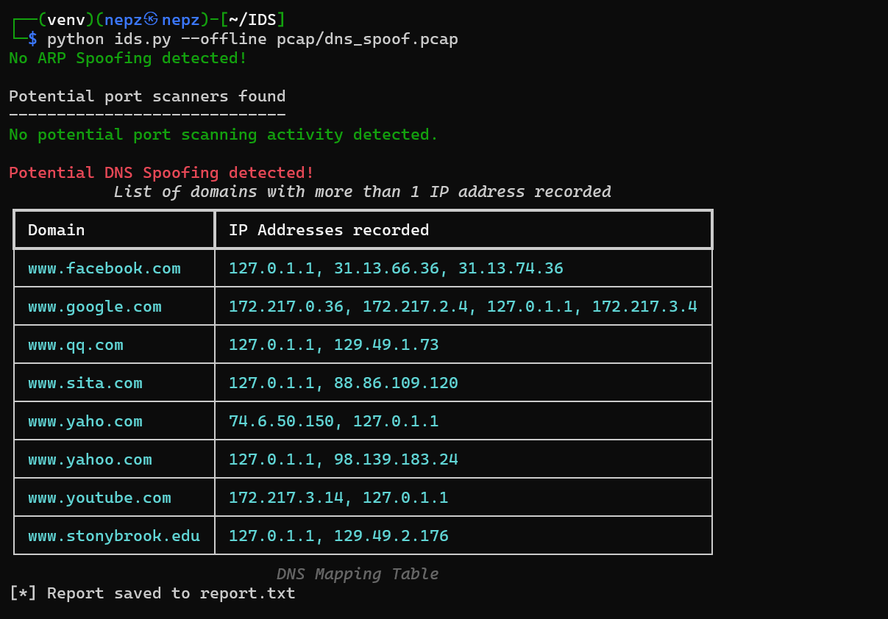
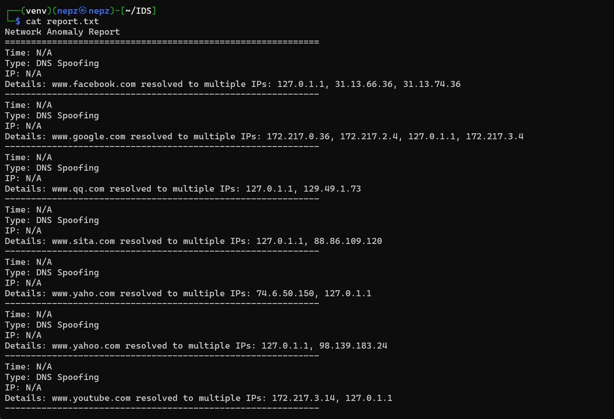
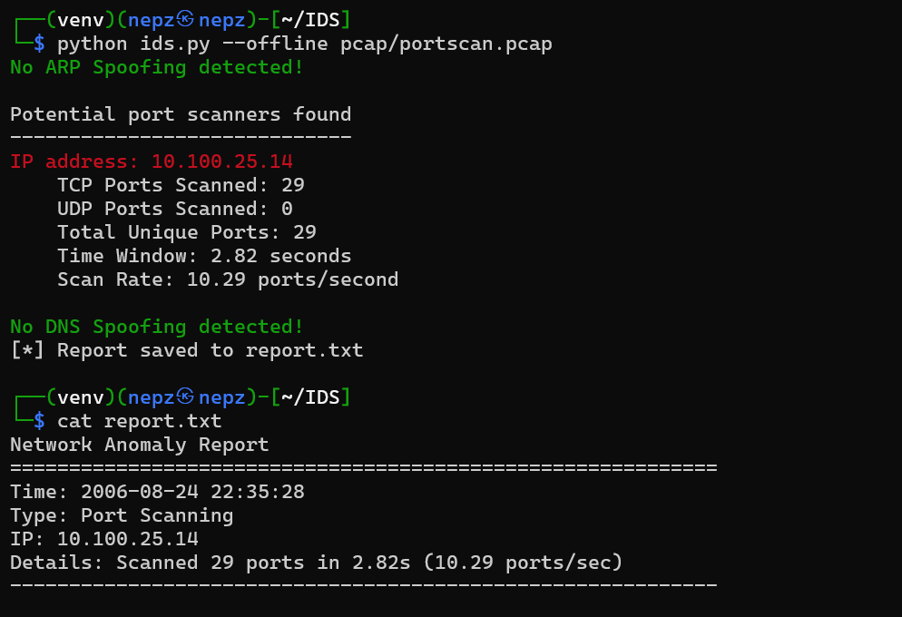

# 🛡️ Intrusion Detection System (IDS)

This repository is an extension of an Intrusion Detection System (IDS) developed as part of the Network Forensics module within the Sentinel Programme.

> Network Forensics Repository: [Sentinel-PS5PI-Network-Forensics](https://github.com/Tan-JunWei/Sentinel-PS5PI-Network-Forensics)

The IDS scripts are written in Python and tested using publicly available `.pcap` files to detect and report suspicious network activities.

---

## Detection Modes

    
    <h4>Online vs Offline Detection Modes</h4>

This IDS supports two modes of operation:

### 🔴 Online Detection (Real-Time)
- Monitors live network traffic on a selected interface.
- Ideal for active monitoring and immediate response in real-world environments.
- Captures and analyzes packets in real-time using libraries such as **Scapy** or **PyShark**.

### 🔵 Offline Detection (PCAP Analysis)
- Analyzes pre-captured packet data from `.pcap` files.
- Useful for post-incident forensic investigation and testing detection logic.
- Supports batch processing of various attack samples.

---

## 🔍 Detection Modules

### Address Resolution Protocol (ARP) Spoofing

ARP spoofing allows an attacker to intercept, modify, or block data intended for another host on a local network.

    
    <h4>Example: ARP Spoofing Detection in Action</h4>

    
    <h4>Generated Report for ARP Spoofing</h4>

---

### Domain Name System (DNS) Spoofing

DNS spoofing redirects traffic from a legitimate server to a malicious one by altering DNS responses.

    
    <h4>Example: DNS Spoofing Detection in Action</h4>

    
    <h4>Generated Report for DNS Spoofing</h4>

---

### Port Scanning

Port scanning is a technique used to identify open ports and services on a target system, often as a precursor to an attack.

    
    <h4>Example: Port Scanning Detection in Action</h4>

---

## Sample PCAP Files

Example `.pcap` files were sourced from reputable online repositories to validate the IDS detection capabilities:

| Attack Type     | Source Link |
|------------------|-------------|
| **ARP Spoofing** | [asecuritysite.com](https://asecuritysite.com/forensics/pcap?infile=arp_spoof.pcap) |
| **DNS Spoofing** | [ManOnTheSideAttack-DNS-Spoofing](https://github.com/waytoalpit/ManOnTheSideAttack-DNS-Spoofing/blob/master/capture.pcap) |
| **Port Scanning**| [markofu/pcaps](https://github.com/markofu/pcaps/blob/master/PracticalPacketAnalysis/ppa-capture-files/portscan.pcap) |

